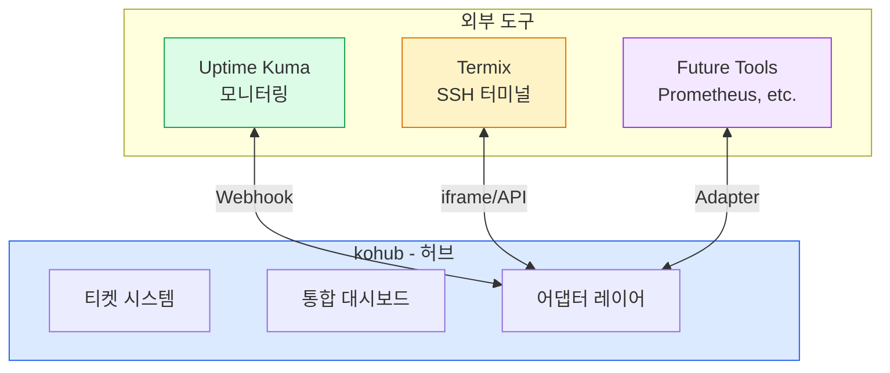
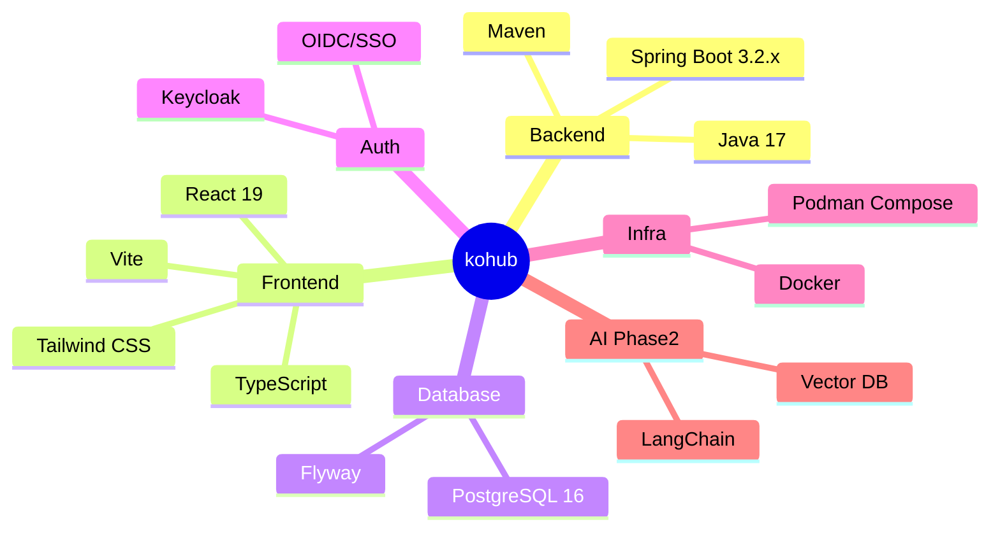
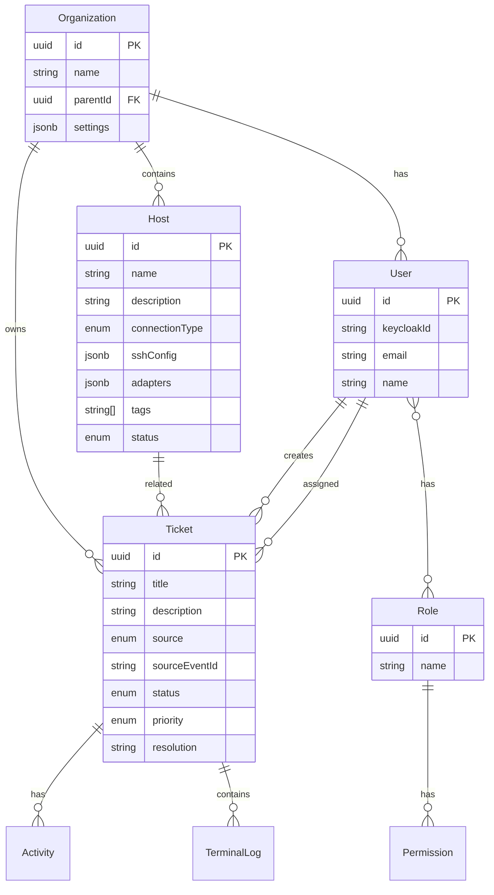
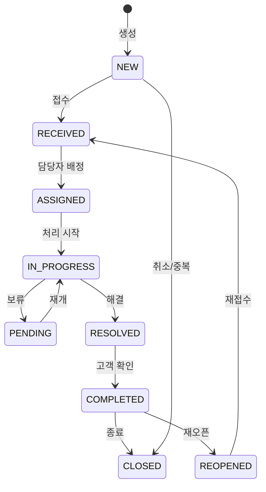
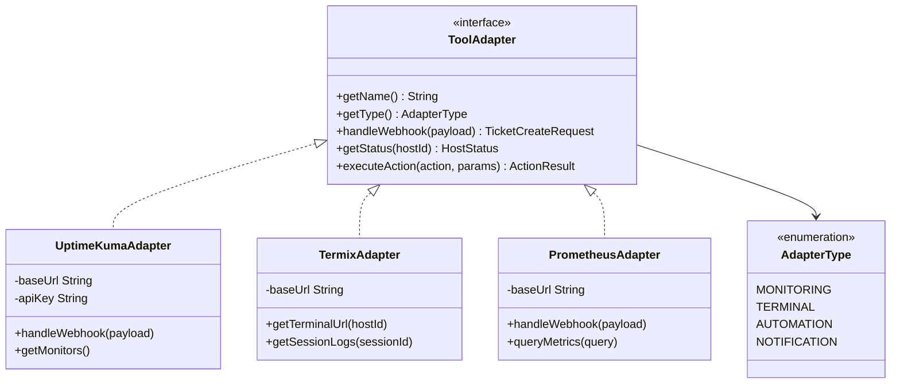
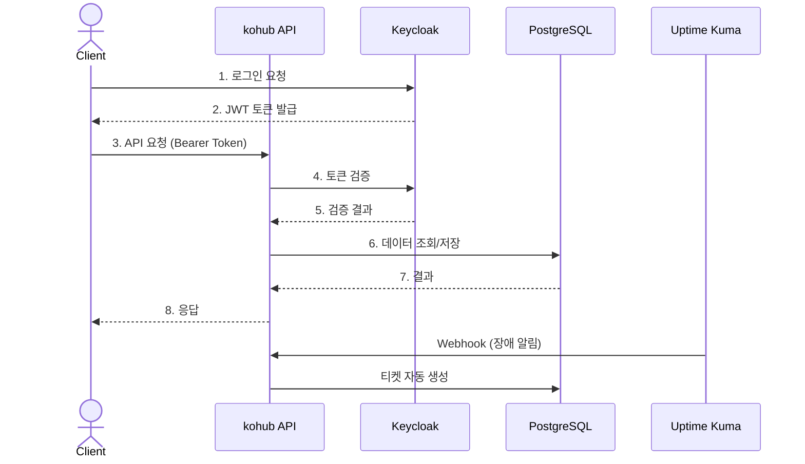
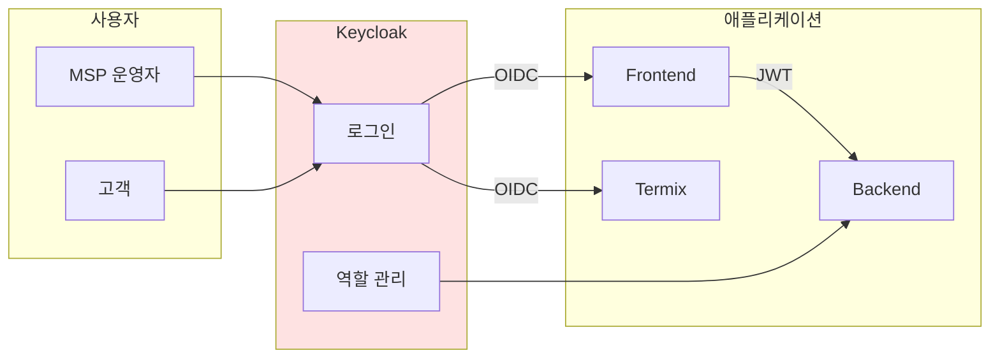
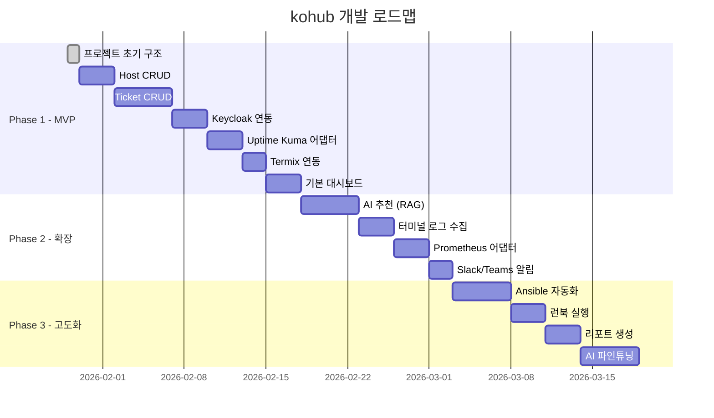

# kohub Agent Guide

## Project Overview
kohub는 MSP(Managed Service Provider) 운영을 위한 통합 플랫폼입니다. 
외부 도구(Uptime Kuma, Termix 등)를 연계하여 모니터링 → 장애 대응 → 이력 관리 → AI 활용의 순환 구조를 제공합니다.

## Core Concept: Hub & Spoke Architecture



## Tech Stack



## Repo Layout

```
kohub/
├── AGENT.md              # 이 파일
├── README.md             # 프로젝트 소개
├── docs/                 # 설계 문서
│   ├── 01_prd.md         # 제품 요구사항
│   ├── 02_architecture.md # 아키텍처 설계
│   ├── 03_api_design.md  # API 설계
│   ├── 04_adapter_spec.md # 어댑터 명세
│   └── 05_ux_design.md   # UI/UX 설계
├── backend/              # Spring Boot 서비스
│   ├── pom.xml
│   ├── Dockerfile
│   └── src/
├── frontend/             # React 앱
│   ├── package.json
│   ├── Dockerfile
│   └── src/
├── keycloak/             # SSO 설정
│   └── import/
├── scripts/              # 유틸리티 스크립트
├── compose.yml           # 개발 환경
├── compose.prod.yml      # 프로덕션 환경
└── .github/              # CI/CD
    └── workflows/
```

## Quick Start (Local Dev)

### Docker/Podman 실행
```bash
# 개발 환경 실행
docker compose up -d

# 또는 Podman
podman-compose up -d
```

### 포트 정보
| 서비스 | 포트 | 설명 |
|--------|------|------|
| DB | 5434 | PostgreSQL |
| Backend | 8082 | Spring Boot API |
| Frontend | 3002 | React Dev Server |
| Keycloak | 8083 | SSO 서버 |

### Health Check
- Backend: `GET http://localhost:8082/actuator/health`
- Frontend: `http://localhost:3002`

## Core Domains

### 도메인 모델 관계도



### 티켓 상태 흐름



## Adapter Interface

### 어댑터 구조



### 지원 어댑터 (계획)
| 어댑터 | 타입 | 상태 |
|--------|------|------|
| uptime-kuma | MONITORING | Phase 1 |
| termix | TERMINAL | Phase 1 |
| prometheus | MONITORING | Phase 2 |
| slack | NOTIFICATION | Phase 2 |
| ansible | AUTOMATION | Phase 3 |

## API Design

### Base URL
- API: `/api/v1`
- 인증: Bearer JWT (Keycloak)

### API 흐름



### 주요 Endpoints
| Method | Endpoint | 설명 |
|--------|----------|------|
| GET | /api/v1/hosts | 호스트 목록 |
| POST | /api/v1/hosts | 호스트 등록 |
| GET | /api/v1/tickets | 티켓 목록 |
| POST | /api/v1/tickets | 티켓 생성 |
| POST | /api/v1/tickets/{id}/assign | 담당자 배정 |
| POST | /api/v1/tickets/{id}/resolve | 해결 처리 |
| GET | /api/v1/dashboard/summary | 대시보드 요약 |
| POST | /api/v1/webhooks/uptime-kuma | Uptime Kuma Webhook |

### 응답 형식
```json
// 성공
{
  "data": { ... },
  "meta": { "timestamp": "...", "requestId": "..." }
}

// 에러
{
  "error": {
    "code": "TICKET_NOT_FOUND",
    "message": "티켓을 찾을 수 없습니다",
    "details": { ... }
  }
}

// 페이지네이션
{
  "data": [ ... ],
  "page": { "number": 0, "size": 20, "totalElements": 100, "totalPages": 5 }
}
```

## Auth & Authorization

### 인증 아키텍처



### Keycloak 역할
| 역할 | 설명 |
|------|------|
| msp-admin | 시스템 전체 관리자 |
| msp-operator | 운영자 (장애 대응) |
| msp-viewer | 읽기 전용 |
| customer-admin | 고객사 관리자 |
| customer | 일반 고객 |

### 권한 매핑
```java
@PreAuthorize("hasRole('msp-admin') or hasRole('msp-operator')")
public void assignTicket(...) { }

@PreAuthorize("@hostSecurity.canAccess(#hostId)")
public void connectTerminal(String hostId) { }
```

## Development Workflow

### 1. 테스트 실행
```bash
# Backend 테스트
cd backend
./mvnw test

# Frontend 린트
cd frontend
npm run lint
npm run type-check
```

### 2. 빌드 검증
```bash
# Backend
cd backend
./mvnw clean compile

# Frontend
cd frontend
npm run build
```

### 3. Commit 규칙
```bash
# 커밋 메시지 (한글)
git commit -m "feat: 호스트 관리 API 구현"
git commit -m "fix: 티켓 상태 전이 버그 수정"
git commit -m "refactor: 어댑터 인터페이스 개선"
```

### 커밋 타입
- `feat:` 새 기능
- `fix:` 버그 수정
- `refactor:` 리팩토링
- `docs:` 문서 수정
- `test:` 테스트 추가/수정
- `chore:` 기타 변경

## Phase Plan



### Phase 1: MVP
- [x] 프로젝트 초기 구조
- [ ] Host CRUD
- [ ] Ticket CRUD + 상태 관리
- [ ] Keycloak 연동
- [ ] Uptime Kuma Webhook 어댑터
- [ ] Termix iframe 연동
- [ ] 기본 대시보드

### Phase 2: 확장
- [ ] AI 추천 (RAG 기반)
- [ ] 터미널 로그 수집
- [ ] Prometheus 어댑터
- [ ] Slack/Teams 알림

### Phase 3: 고도화
- [ ] Ansible 자동화 연동
- [ ] 런북 실행
- [ ] 리포트 생성
- [ ] AI 파인튜닝

## Conventions

### 코드 규칙
- 테스트 함수명: `test[Method]_Scenario` (영어)
- @DisplayName / 주석 / 커밋 메시지: 한글
- API 응답: 일관된 DTO 사용

### 파일 명명
- Backend: PascalCase (Java 표준)
- Frontend: PascalCase (컴포넌트), camelCase (유틸)
- API: kebab-case

---

## References
- [Uptime Kuma](https://github.com/louislam/uptime-kuma)
- [Termix](https://github.com/Termix-SSH/Termix)
- [Keycloak](https://www.keycloak.org/)
- [KustHub](../KustHub) - 고객 커뮤니케이션 허브 (연계 대상)
- [StockHub](../StockHub) - 참고 프로젝트
- [UI/UX 설계](./docs/05_ux_design.md)
- [KustHub 연계 설계](./docs/06_integration_design.md)

## Changelog

- 2026-01-30: KustHub 연계 설계 문서 추가 (06_integration_design.md)
  - 세부 도메인 모델 설계
  - 이벤트 기반 연계 아키텍처
  - API 설계 상세
