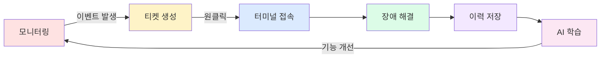
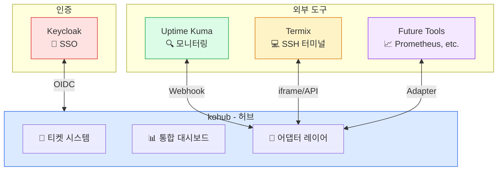
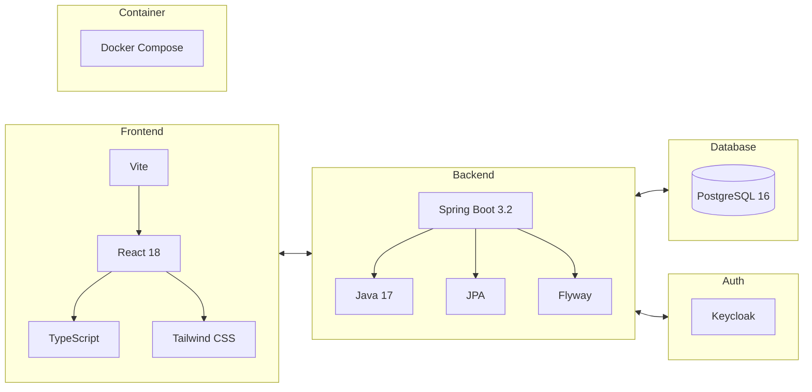
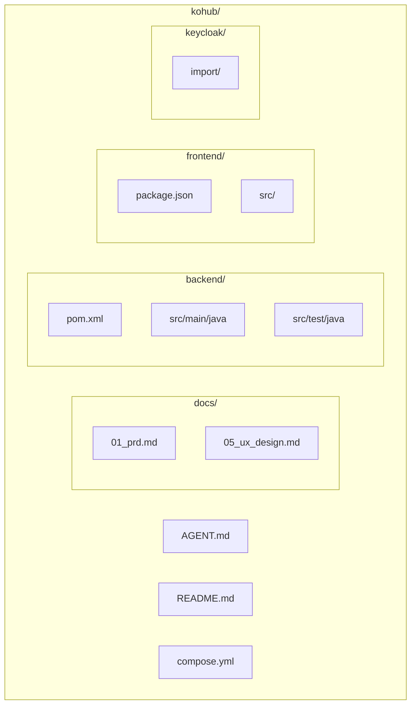
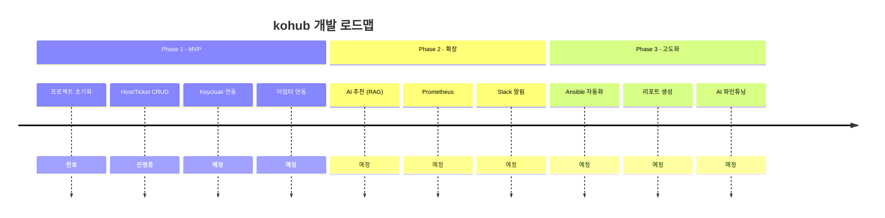

# kohub

MSP(Managed Service Provider) 통합 운영 플랫폼

## 개요

kohub는 모니터링, 장애 대응, 이력 관리를 하나의 플랫폼으로 통합합니다.



## 주요 기능

- **통합 대시보드**: 모든 시스템 상태를 한눈에
- **티켓 시스템**: 장애/요청 이력 관리
- **터미널 연동**: 원클릭 SSH 접속 (Termix 연동)
- **모니터링 연동**: Uptime Kuma Webhook 수신
- **권한 관리**: Keycloak SSO 기반 통합 인증
- **AI 추천**: 유사 장애 해결책 제안 (Phase 2)

## 아키텍처



## 기술 스택



| 영역 | 기술 |
|------|------|
| Backend | Spring Boot 3.2, Java 17, Maven |
| Frontend | Vite, React 18, TypeScript, Tailwind CSS |
| Database | PostgreSQL 16, Flyway |
| Auth | Keycloak (OIDC/SSO) |
| Container | Docker/Podman Compose |

## 빠른 시작

### 요구사항

- Docker 또는 Podman
- Docker Compose 또는 Podman Compose

### 실행

```bash
# 저장소 클론
git clone https://github.com/bullpae/kohub.git
cd kohub

# 개발 환경 실행
docker compose up -d

# 또는 Podman
podman-compose up -d
```

### 포트 정보

| 서비스 | 포트 | 설명 |
|--------|------|------|
| Frontend | 3002 | React Dev Server |
| Backend | 8082 | Spring Boot API |
| Database | 5434 | PostgreSQL |

### 접속

- Frontend: http://localhost:3002
- Backend API: http://localhost:8082/api/v1
- API 문서: http://localhost:8082/swagger-ui.html

## 프로젝트 구조



## 개발

### Backend 개발

```bash
cd backend

# 의존성 설치 및 빌드
./mvnw clean compile

# 테스트 실행
./mvnw test

# 로컬 실행
./mvnw spring-boot:run
```

### Frontend 개발

```bash
cd frontend

# 의존성 설치
npm install

# 개발 서버 실행
npm run dev

# 타입 체크
npm run type-check

# 린트
npm run lint

# 빌드
npm run build
```

## 로드맵



## 문서

- [AGENT.md](./AGENT.md) - 프로젝트 상세 가이드
- [docs/05_ux_design.md](./docs/05_ux_design.md) - UI/UX 설계

## 기여

1. Fork the repository
2. Create your feature branch (`git checkout -b feature/amazing-feature`)
3. Commit your changes (`git commit -m 'feat: 기능 설명'`)
4. Push to the branch (`git push origin feature/amazing-feature`)
5. Open a Pull Request

## 라이선스

MIT License
