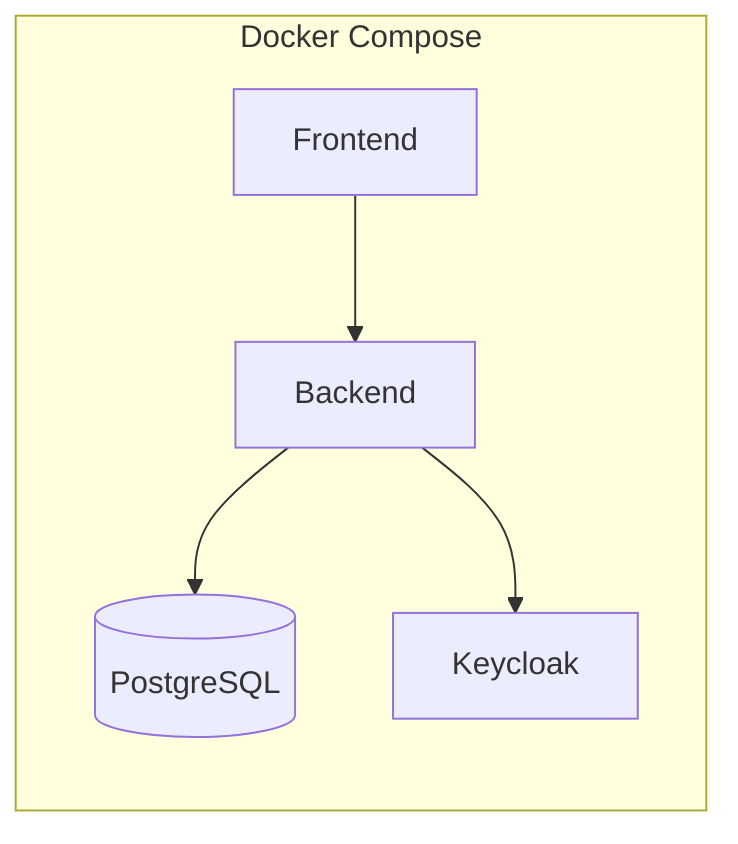

# kohub 아키텍처 설계

## 1. 시스템 개요
kohub는 MSP 운영을 위한 허브 플랫폼으로, 외부 도구(Uptime Kuma, Termix 등)와 연동하여 모니터링 → 장애 대응 → 이력 관리 흐름을 통합한다.

## 2. 논리 아키텍처
```mermaid
flowchart TB
  subgraph Client
    FE[Frontend (React)]
  end

  subgraph Backend
    API[Spring Boot API]
    AL[Adapter Layer]
  end

  subgraph Data
    DB[(PostgreSQL)]
  end

  subgraph Auth
    KC[Keycloak]
  end

  subgraph External
    UK[Uptime Kuma]
    TX[Termix]
  end

  FE -->|REST/WS| API
  API --> DB
  API -->|OIDC| KC
  UK -->|Webhook| AL
  AL --> API
  API -->|iframe url| TX
```

## 3. 컴포넌트 책임
| 컴포넌트 | 책임 |
|---|---|
| Frontend | 대시보드/티켓/호스트 UI, 실시간 상태 표시 |
| API | 도메인 로직, RBAC, 통합 데이터 제공 |
| Adapter Layer | 외부 도구 이벤트 수신 및 표준화 |
| DB | 티켓/호스트/조직/이력 저장 |
| Keycloak | 인증 및 권한 관리 |

## 4. 데이터 흐름
### 4.1 모니터링 이벤트
1. Uptime Kuma Webhook 수신
2. Adapter Layer가 이벤트 표준화
3. API에서 티켓 자동 생성
4. Frontend 알림 및 목록 갱신

### 4.2 운영자 대응
1. 운영자 티켓 상세 확인
2. Termix iframe 연결
3. 작업 로그 기록
4. 해결 처리 후 상태 전이

## 5. 배포 아키텍처


## 6. 가용성/확장성 고려
- 서비스는 stateless API로 구성하여 수평 확장 가능
- DB는 단일 인스턴스로 시작하되, Phase 2에서 read replica 검토
- WebSocket 연결 수 증가에 대비해 API 노드별 로드밸런싱 고려

## 7. 보안 아키텍처
- 모든 API 요청은 Keycloak JWT 검증 필수
- 조직/테넌트 단위 데이터 분리
- 감사 로그는 별도 테이블로 저장

## 8. 운영 및 모니터링
- Backend: Spring Actuator 기반 헬스 체크
- Frontend: 정적 빌드 후 CDN 배포 가능
- 로그: API 요청/응답, 티켓 상태 변경 기록
