# kohub UI/UX 설계

## 1. 사용자(Actor) 정의

| Actor | 역할 | 주요 관심사 |
|-------|------|------------|
| **MSP 관리자** | 시스템 전체 관리 | 설정, 사용자 관리, 리포트 |
| **MSP 운영자** | 장애 대응, 일상 운영 | 모니터링, 티켓 처리, 터미널 |
| **접수 담당자** | 티켓 접수/배정 | 티켓 분류, 담당자 배정 |
| **고객사 관리자** | 자사 서버 현황 파악 | 상태 조회, 티켓 요청 |
| **고객** | 서비스 요청 | 티켓 생성, 진행 상황 확인 |

---

## 2. 핵심 Use Case

### UC-01: 장애 발생 → 즉시 대응 (핵심 플로우)

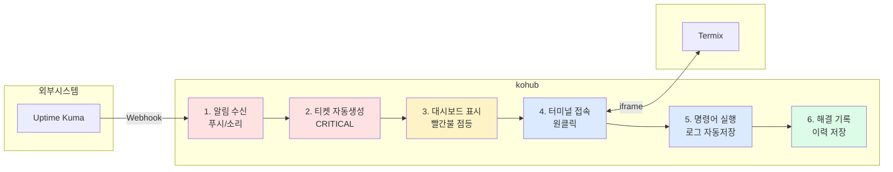

**필요한 화면:**
- 실시간 알림 (토스트/사운드)
- 대시보드 (장애 현황 한눈에)
- 티켓 상세 (즉시 터미널 연결)
- 터미널 (iframe)
- 해결 기록 폼

---

### UC-02: 일상 모니터링

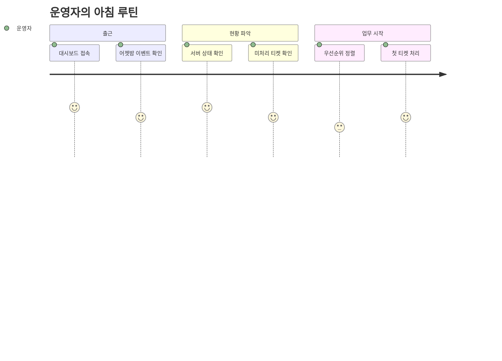

**필요한 화면:**
- 대시보드 (요약 통계)
- 이벤트 타임라인
- 서버 상태 그리드
- 티켓 목록 (필터/정렬)

---

### UC-03: 티켓 처리 전체 흐름

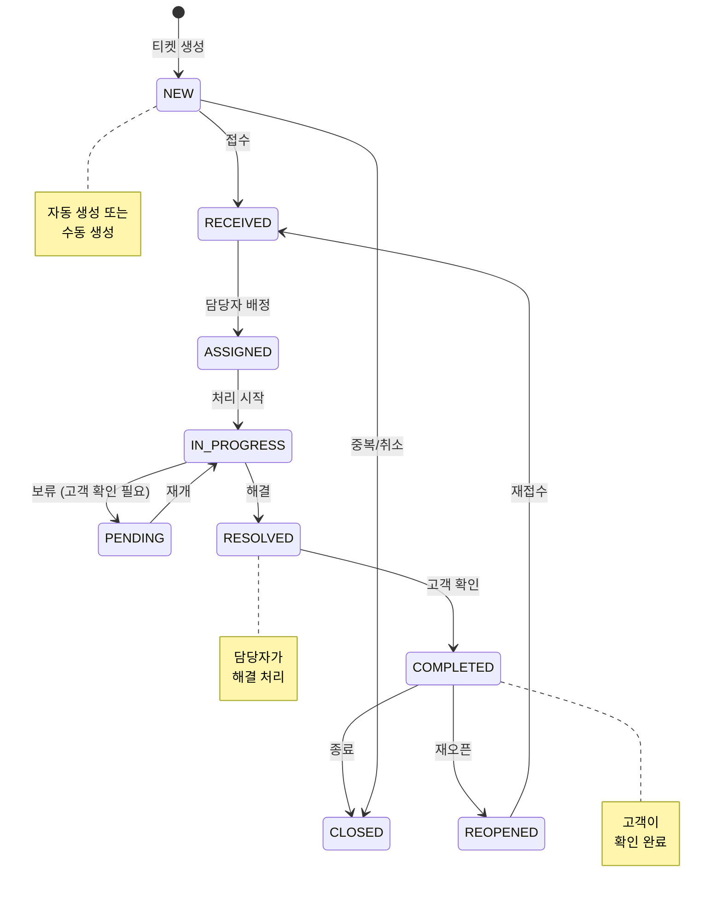

**필요한 화면:**
- 티켓 목록 (상태별 탭/칸반)
- 티켓 상세 (상태 전이 버튼)
- 담당자 배정 모달
- 활동 기록 타임라인

---

### UC-04: 고객 요청 접수

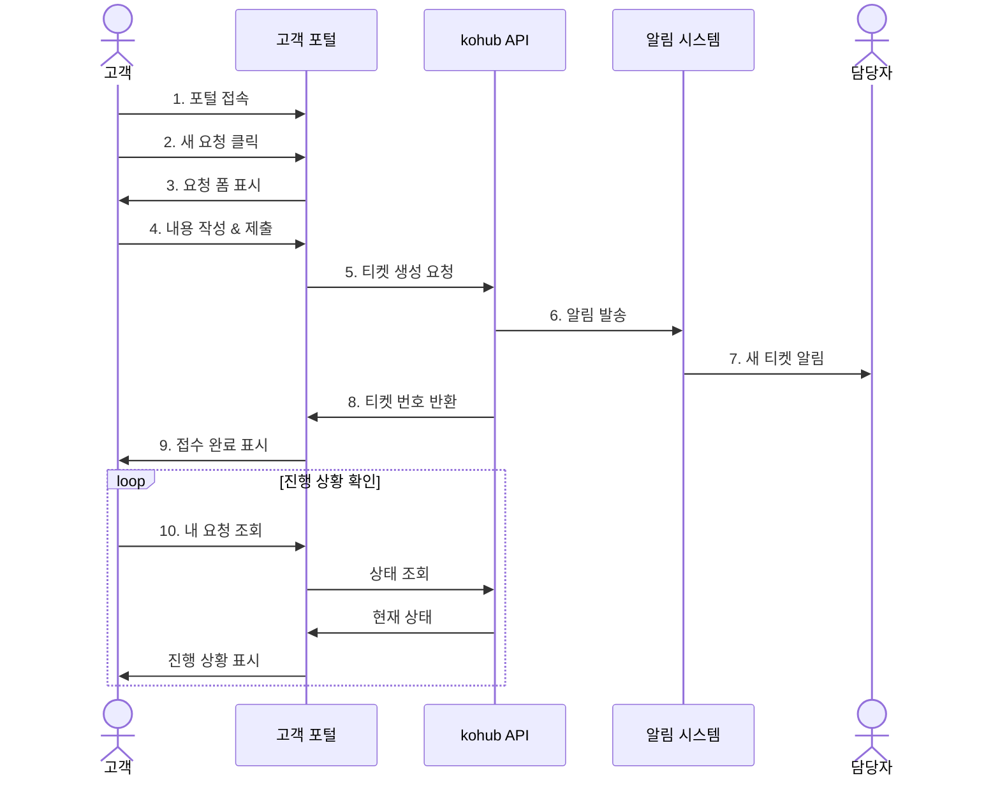

**필요한 화면:**
- 고객 포털 (심플한 UI)
- 요청 작성 폼
- 내 요청 목록
- 요청 상세 (진행 상황)

---

### UC-05: AI 추천 활용 (Phase 2)

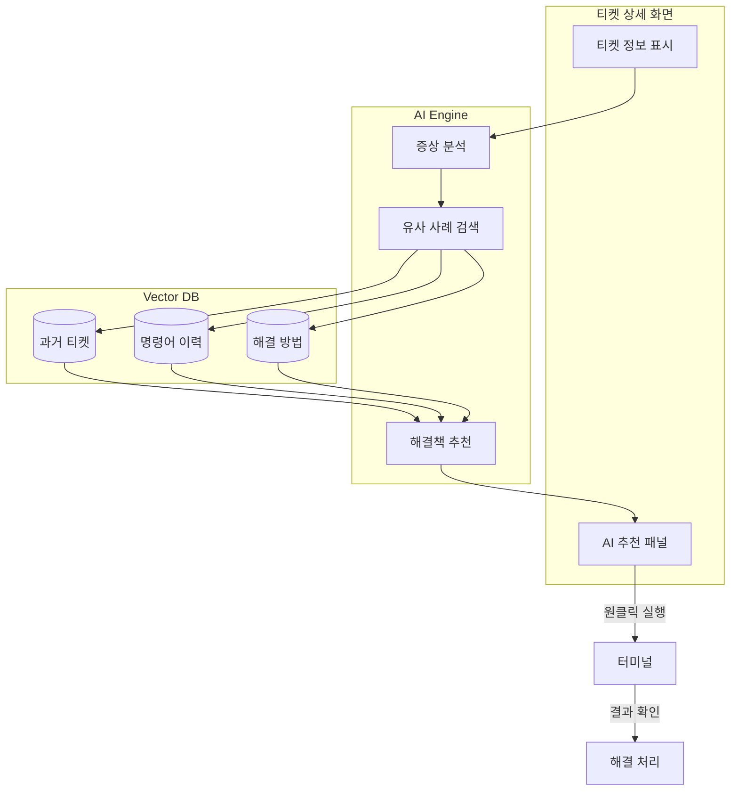

**필요한 화면:**
- AI 추천 패널 (티켓 상세 내)
- 유사 사례 목록
- 명령어 프리뷰/실행 버튼

---

## 3. 화면 구조 설계

### 3.1 전체 레이아웃

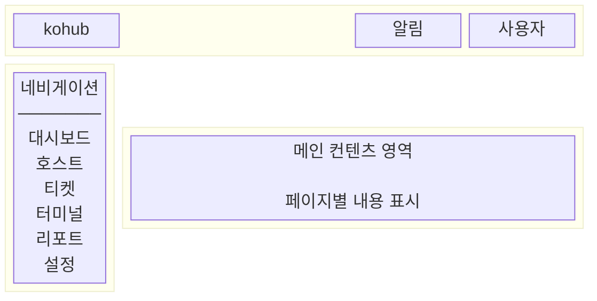

### 3.2 네비게이션 구조

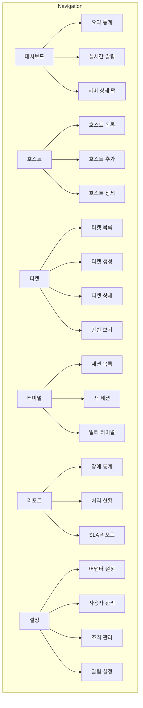

---

## 4. 주요 화면 상세 설계

### 4.1 대시보드 (Dashboard)

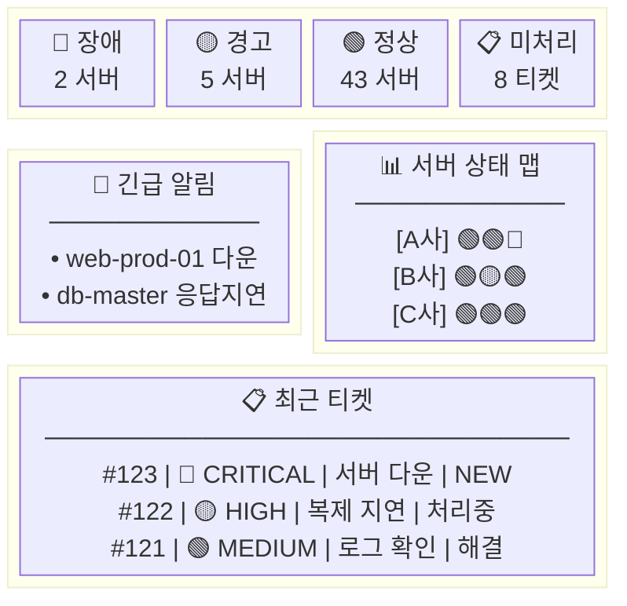

**핵심 UX:**
- 장애 시 빨간색이 눈에 확 들어오도록
- "터미널" 버튼으로 즉시 접속
- 실시간 갱신 (WebSocket)

---

### 4.2 티켓 상세 + 터미널 (Split View)

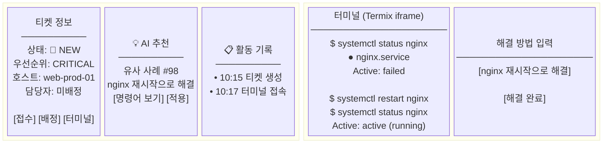

**핵심 UX:**
- 티켓 정보와 터미널을 한 화면에 (Split View)
- 명령어 자동 로깅
- AI 추천이 자연스럽게 표시
- 해결 방법 입력 후 바로 완료 처리

---

### 4.3 티켓 목록 (칸반 뷰)

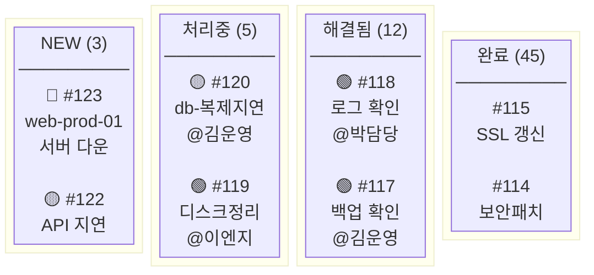

---

### 4.4 고객 포털

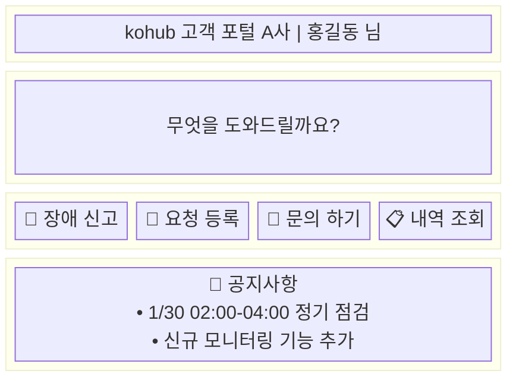

---

## 5. 화면 흐름도

### 5.1 장애 대응 흐름

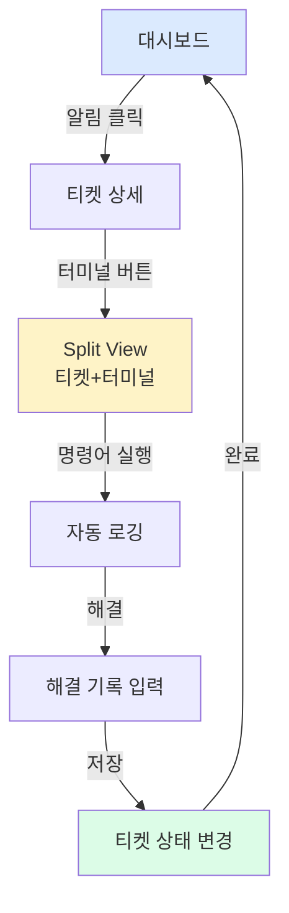

### 5.2 티켓 생성 흐름

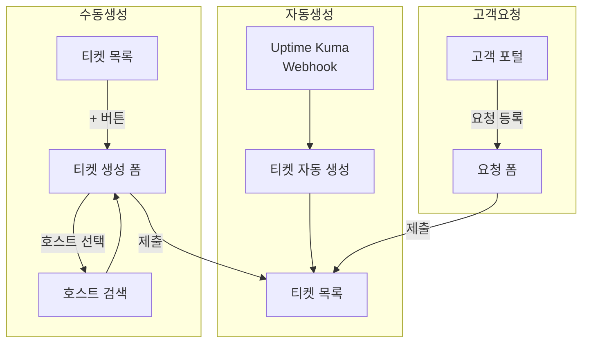

---

## 6. UI/UX 핵심 원칙

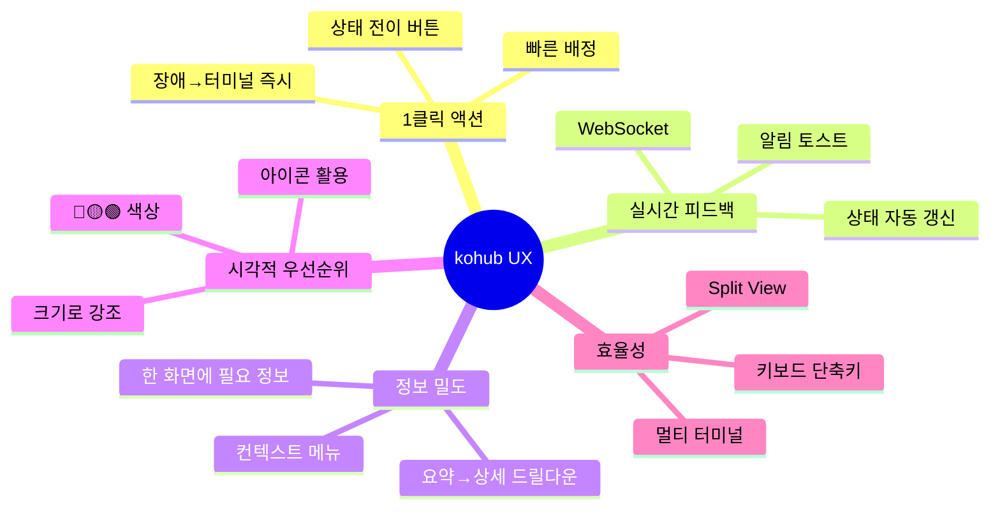

---

## 7. 반응형 설계

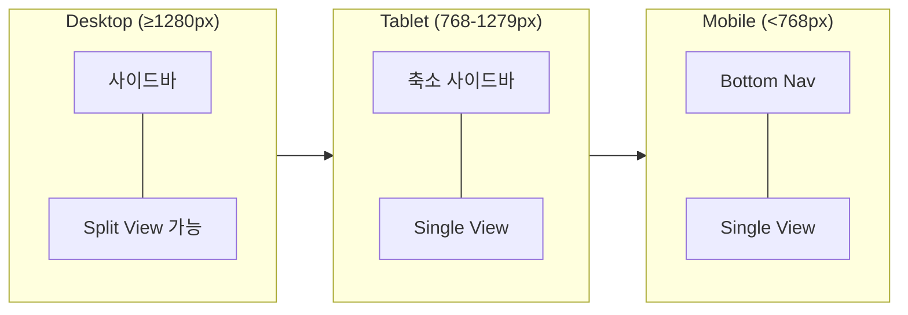

---

## 8. 컴포넌트 계층

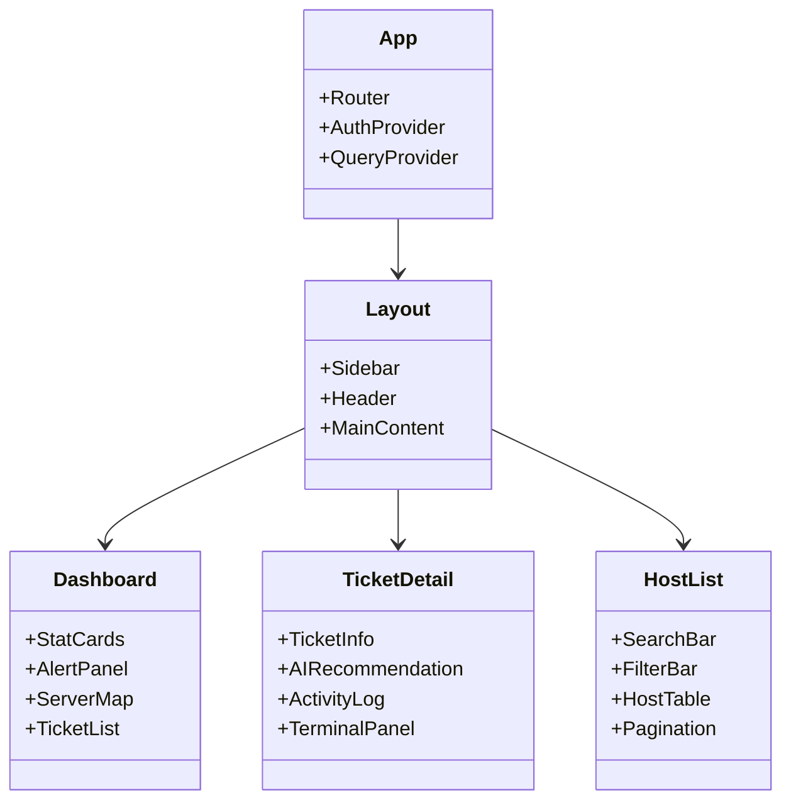

---

## 9. 색상 시스템

| 용도 | 색상 | Tailwind |
|------|------|----------|
| 장애/Critical | 🔴 Red | `red-500` |
| 경고/High | 🟡 Yellow | `yellow-500` |
| 정상/Low | 🟢 Green | `green-500` |
| 정보/Medium | 🔵 Blue | `blue-500` |
| 비활성 | ⚫ Gray | `gray-400` |
| 프라이머리 | - | `primary-600` |
| 배경 | - | `gray-50` |
| 카드 배경 | - | `white` |

---

## 10. 키보드 단축키 (계획)

| 단축키 | 동작 |
|--------|------|
| `G` + `D` | 대시보드로 이동 |
| `G` + `H` | 호스트 목록으로 이동 |
| `G` + `T` | 티켓 목록으로 이동 |
| `N` | 새 티켓 생성 |
| `T` | 터미널 열기 (티켓 상세에서) |
| `/` | 검색 포커스 |
| `Esc` | 모달/패널 닫기 |
| `?` | 단축키 도움말 |

---

## 11. 다음 단계

1. **Figma/디자인 툴**로 상세 UI 디자인
2. **프로토타입** 제작 및 사용자 테스트
3. **컴포넌트 라이브러리** 구축
4. **페이지별 구현** 진행
