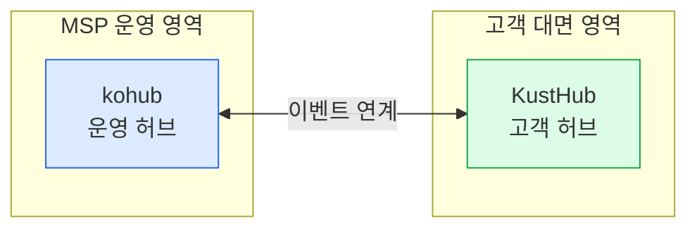
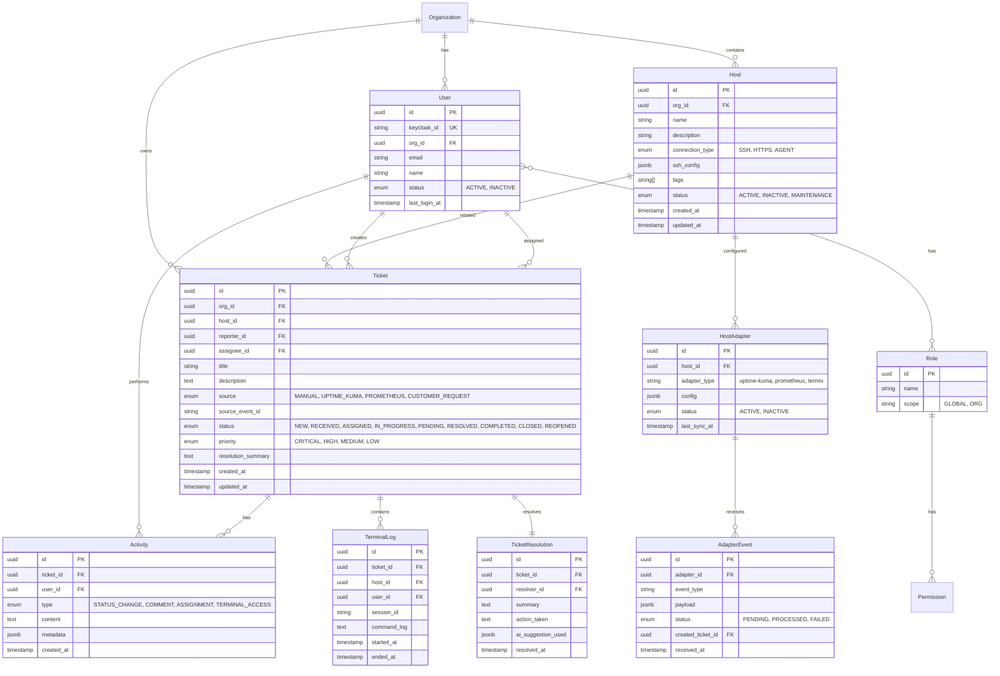
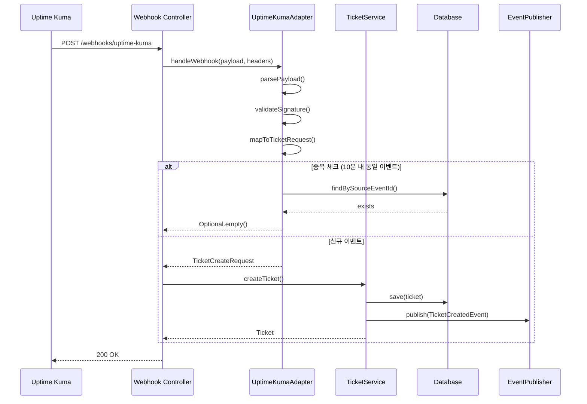
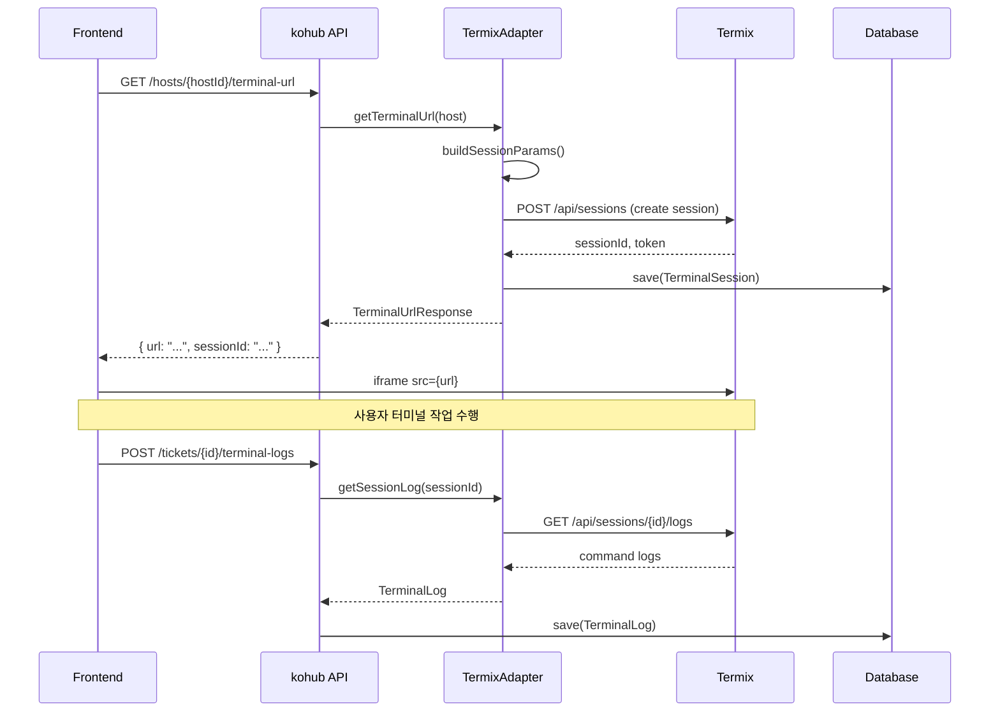
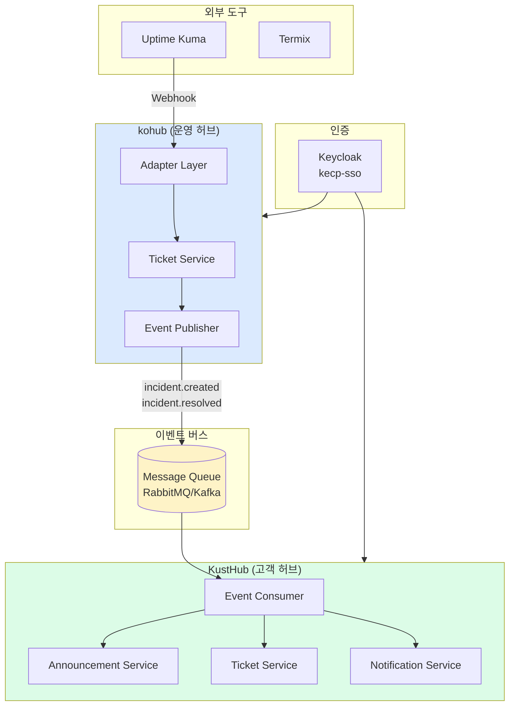
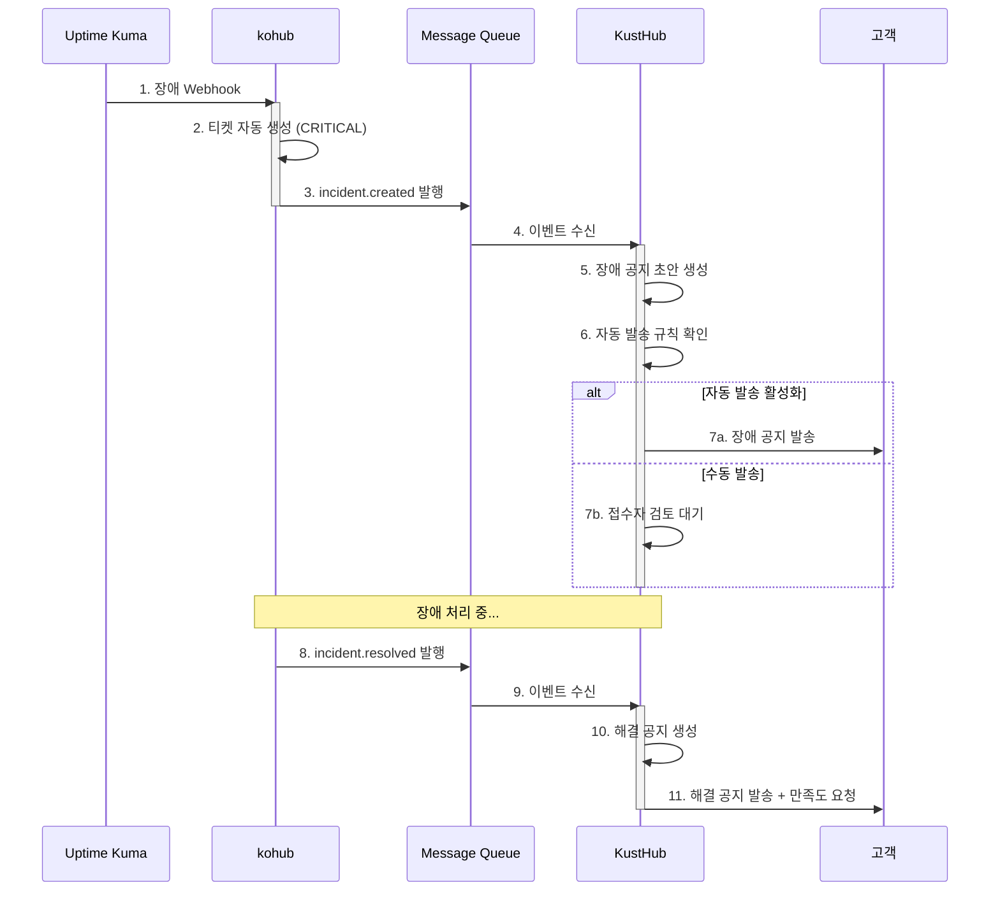
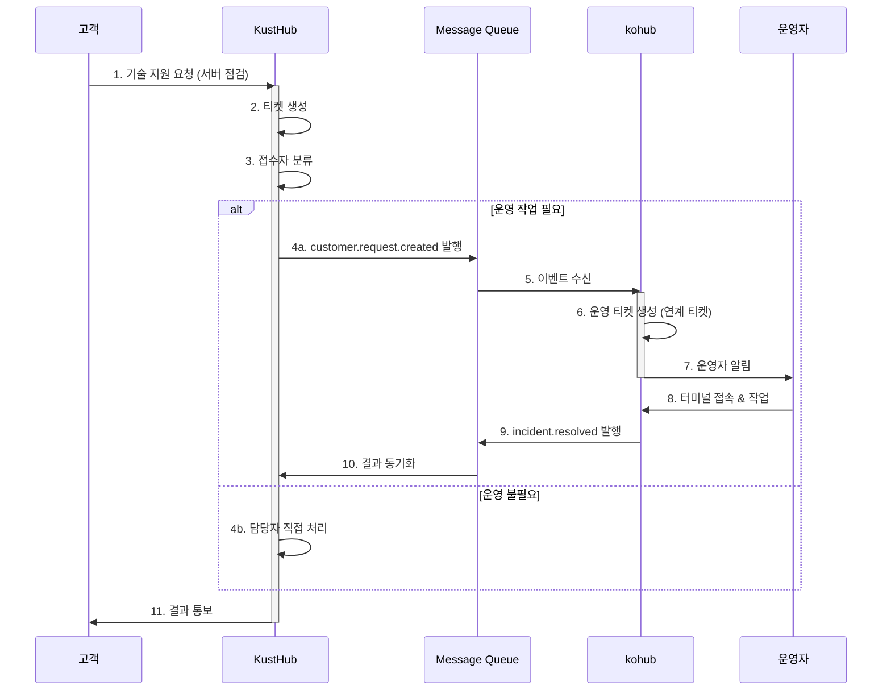
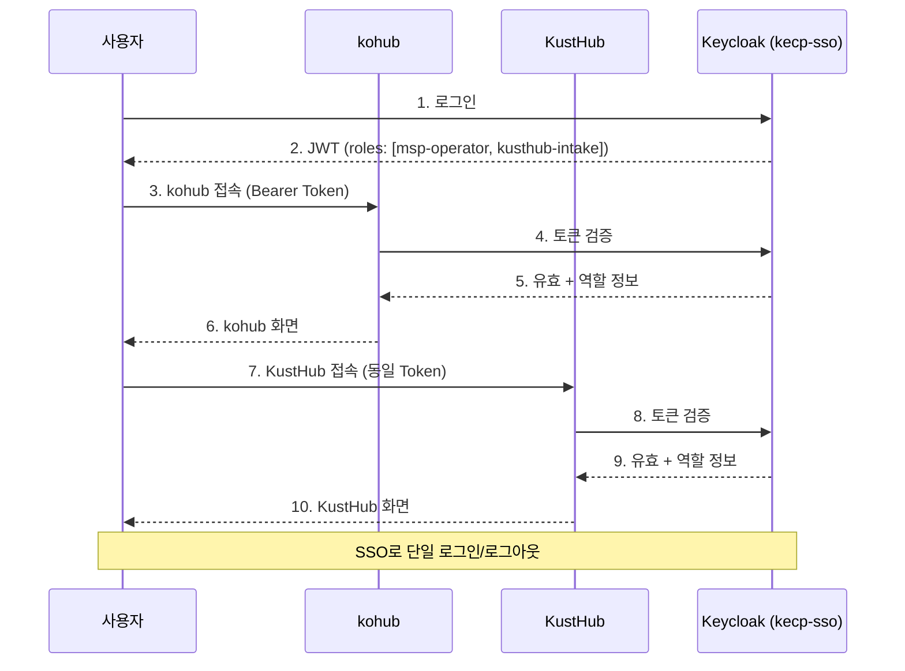

# kohub 세부 설계 및 KustHub 연계 계획

## 1. 문서 개요

### 1.1 목적
본 문서는 kohub(MSP 운영 허브)의 세부 설계를 정의하고, KustHub(고객 커뮤니케이션 허브)와의 연계 방안을 수립한다.

### 1.2 서비스 포지셔닝



| 구분 | kohub | KustHub |
|------|-------|---------|
| **정체성** | MSP 통합 운영 플랫폼 | CSP/MSP 고객 커뮤니케이션 플랫폼 |
| **핵심 가치** | 장애 대응 시간 단축, 도구 통합, 지식 축적 | 공지 품질, 요청 가시성, SLA 준수 |
| **관점** | Inside-Out (운영자 → 시스템 → 고객) | Outside-In (고객 → 시스템 → 운영자) |
| **핵심 도메인** | Host, Adapter, TerminalLog, AI추천 | Announcement, SLA, ReadReceipt, CSAT |

---

## 2. kohub 세부 도메인 설계

### 2.1 도메인 모델 상세



### 2.2 티켓 상태 전이 규칙

```mermaid
stateDiagram-v2
    [*] --> NEW: 생성 (자동/수동)
    
    NEW --> RECEIVED: 접수
    NEW --> CLOSED: 중복/취소
    
    RECEIVED --> ASSIGNED: 담당자 배정
    
    ASSIGNED --> IN_PROGRESS: 처리 시작
    
    IN_PROGRESS --> PENDING: 보류 (고객 확인/외부 대기)
    IN_PROGRESS --> RESOLVED: 해결
    
    PENDING --> IN_PROGRESS: 재개
    PENDING --> RESOLVED: 해결
    
    RESOLVED --> COMPLETED: 고객 확인
    RESOLVED --> REOPENED: 재오픈
    
    COMPLETED --> CLOSED: 종료
    COMPLETED --> REOPENED: 재오픈
    
    REOPENED --> RECEIVED: 재접수
    
    note right of NEW: source별 분기<br/>UPTIME_KUMA: 자동<br/>MANUAL: 수동
    note right of RESOLVED: KustHub에<br/>이벤트 전파
    note right of COMPLETED: 고객 확인은<br/>KustHub에서 처리
```

#### 상태 전이 매트릭스

| From \ To | RECEIVED | ASSIGNED | IN_PROGRESS | PENDING | RESOLVED | COMPLETED | CLOSED | REOPENED |
|-----------|----------|----------|-------------|---------|----------|-----------|--------|----------|
| NEW | ✅ | - | - | - | - | - | ✅ | - |
| RECEIVED | - | ✅ | - | - | - | - | - | - |
| ASSIGNED | - | - | ✅ | - | - | - | - | - |
| IN_PROGRESS | - | - | - | ✅ | ✅ | - | - | - |
| PENDING | - | - | ✅ | - | ✅ | - | - | - |
| RESOLVED | - | - | - | - | - | ✅ | - | ✅ |
| COMPLETED | - | - | - | - | - | - | ✅ | ✅ |
| REOPENED | ✅ | - | - | - | - | - | - | - |

### 2.3 어댑터 상세 설계

#### 어댑터 인터페이스

```java
public interface ToolAdapter {
    // 메타데이터
    String getName();
    AdapterType getType();
    AdapterCapability[] getCapabilities();
    
    // Webhook 처리
    Optional<TicketCreateRequest> handleWebhook(String payload, Map<String, String> headers);
    
    // 상태 조회
    HostStatus getStatus(Host host);
    List<MonitorEvent> getRecentEvents(Host host, Duration period);
    
    // 액션 실행
    ActionResult executeAction(Host host, String action, Map<String, Object> params);
    
    // 헬스 체크
    AdapterHealth checkHealth();
}

public enum AdapterType {
    MONITORING,   // 모니터링 (Uptime Kuma, Prometheus)
    TERMINAL,     // 터미널 (Termix)
    AUTOMATION,   // 자동화 (Ansible) - Phase 3
    NOTIFICATION  // 알림 (Slack, Teams) - Phase 2
}

public enum AdapterCapability {
    WEBHOOK_RECEIVE,      // Webhook 수신 가능
    STATUS_QUERY,         // 상태 조회 가능
    ACTION_EXECUTE,       // 액션 실행 가능
    LOG_COLLECT,          // 로그 수집 가능
    BIDIRECTIONAL_SYNC    // 양방향 동기화 가능
}
```

#### Uptime Kuma 어댑터



**Webhook Payload 매핑:**

```json
// Uptime Kuma Payload
{
  "monitor": {
    "id": 1,
    "name": "web-prod-01",
    "url": "https://example.com",
    "type": "http"
  },
  "heartbeat": {
    "status": 0,
    "time": "2026-01-30T10:15:00Z",
    "msg": "Connection refused",
    "duration": 5000
  },
  "msg": "🔴 DOWN"
}

// → kohub TicketCreateRequest
{
  "title": "[장애] web-prod-01 - Connection refused",
  "description": "Uptime Kuma 모니터링 알림\n\n모니터: web-prod-01\n상태: DOWN\n시간: 2026-01-30T10:15:00Z\n메시지: Connection refused",
  "source": "UPTIME_KUMA",
  "sourceEventId": "uptime-kuma-1-20260130T101500",
  "priority": "CRITICAL",
  "hostId": "mapped-host-uuid"
}
```

#### Termix 어댑터



---

## 3. API 설계 상세

### 3.1 엔드포인트 전체 목록

#### Host API

| Method | Endpoint | 설명 | 권한 |
|--------|----------|------|------|
| GET | /api/v1/hosts | 호스트 목록 조회 | msp-operator |
| POST | /api/v1/hosts | 호스트 생성 | msp-admin |
| GET | /api/v1/hosts/{id} | 호스트 상세 조회 | msp-operator |
| PUT | /api/v1/hosts/{id} | 호스트 수정 | msp-admin |
| DELETE | /api/v1/hosts/{id} | 호스트 비활성화 | msp-admin |
| GET | /api/v1/hosts/{id}/status | 호스트 상태 조회 (어댑터 연동) | msp-operator |
| GET | /api/v1/hosts/{id}/terminal-url | 터미널 URL 생성 | msp-operator |
| GET | /api/v1/hosts/{id}/adapters | 호스트 어댑터 목록 | msp-operator |
| POST | /api/v1/hosts/{id}/adapters | 호스트 어댑터 추가 | msp-admin |

#### Ticket API

| Method | Endpoint | 설명 | 권한 |
|--------|----------|------|------|
| GET | /api/v1/tickets | 티켓 목록 조회 | msp-operator |
| POST | /api/v1/tickets | 티켓 생성 | msp-operator, customer |
| GET | /api/v1/tickets/{id} | 티켓 상세 조회 | msp-operator, ticket-owner |
| PUT | /api/v1/tickets/{id} | 티켓 수정 | msp-operator |
| POST | /api/v1/tickets/{id}/receive | 티켓 접수 | msp-operator |
| POST | /api/v1/tickets/{id}/assign | 담당자 배정 | msp-operator |
| POST | /api/v1/tickets/{id}/transition | 상태 전이 | msp-operator |
| POST | /api/v1/tickets/{id}/resolve | 해결 처리 | msp-operator |
| POST | /api/v1/tickets/{id}/complete | 완료 처리 (고객 확인) | customer |
| POST | /api/v1/tickets/{id}/reopen | 재오픈 | customer, msp-operator |
| GET | /api/v1/tickets/{id}/activities | 활동 목록 | msp-operator |
| POST | /api/v1/tickets/{id}/comments | 코멘트 추가 | msp-operator, customer |
| POST | /api/v1/tickets/{id}/terminal-logs | 터미널 로그 저장 | msp-operator |

#### Dashboard API

| Method | Endpoint | 설명 | 권한 |
|--------|----------|------|------|
| GET | /api/v1/dashboard/summary | 요약 통계 | msp-operator |
| GET | /api/v1/dashboard/hosts-status | 호스트 상태 분포 | msp-operator |
| GET | /api/v1/dashboard/tickets-status | 티켓 상태 분포 | msp-operator |
| GET | /api/v1/dashboard/recent-alerts | 최근 알림 | msp-operator |
| GET | /api/v1/dashboard/recent-tickets | 최근 티켓 | msp-operator |

#### Webhook API

| Method | Endpoint | 설명 | 인증 |
|--------|----------|------|------|
| POST | /api/v1/webhooks/uptime-kuma | Uptime Kuma 이벤트 수신 | Signature |
| POST | /api/v1/webhooks/prometheus | Prometheus 알림 수신 (Phase 2) | Signature |

#### Integration API (내부)

| Method | Endpoint | 설명 | 용도 |
|--------|----------|------|------|
| POST | /api/internal/events/publish | 이벤트 발행 | KustHub 연계 |
| GET | /api/internal/tickets/{id}/sync | 티켓 동기화 조회 | KustHub 연계 |

### 3.2 Request/Response DTO 상세

#### Host DTOs

```json
// HostCreateRequest
{
  "name": "web-prod-01",
  "description": "메인 웹 서버",
  "connectionType": "SSH",
  "sshConfig": {
    "host": "10.0.0.1",
    "port": 22,
    "username": "admin"
  },
  "tags": ["production", "web", "frontend"],
  "organizationId": "org-uuid"
}

// HostResponse
{
  "id": "host-uuid",
  "name": "web-prod-01",
  "description": "메인 웹 서버",
  "connectionType": "SSH",
  "sshConfig": {
    "host": "10.0.0.1",
    "port": 22,
    "username": "admin"
  },
  "tags": ["production", "web", "frontend"],
  "status": "ACTIVE",
  "organizationId": "org-uuid",
  "organizationName": "A사",
  "adapters": [
    {
      "type": "uptime-kuma",
      "status": "ACTIVE",
      "lastSyncAt": "2026-01-30T10:00:00Z"
    }
  ],
  "currentStatus": {
    "status": "UP",
    "checkedAt": "2026-01-30T10:15:00Z"
  },
  "createdAt": "2026-01-01T00:00:00Z",
  "updatedAt": "2026-01-30T10:00:00Z"
}
```

#### Ticket DTOs

```json
// TicketCreateRequest
{
  "title": "서버 응답 지연",
  "description": "web-prod-01 서버의 응답 시간이 5초 이상 지연됩니다.",
  "hostId": "host-uuid",
  "priority": "HIGH",
  "source": "MANUAL"
}

// TicketDetailResponse
{
  "id": "ticket-uuid",
  "title": "서버 응답 지연",
  "description": "web-prod-01 서버의 응답 시간이 5초 이상 지연됩니다.",
  "source": "MANUAL",
  "sourceEventId": null,
  "status": "IN_PROGRESS",
  "priority": "HIGH",
  "host": {
    "id": "host-uuid",
    "name": "web-prod-01",
    "status": "ACTIVE"
  },
  "reporter": {
    "id": "user-uuid",
    "name": "김운영"
  },
  "assignee": {
    "id": "user-uuid",
    "name": "이담당"
  },
  "resolution": null,
  "activities": [
    {
      "id": "activity-uuid",
      "type": "STATUS_CHANGE",
      "content": "상태 변경: NEW → RECEIVED",
      "user": { "id": "...", "name": "김운영" },
      "createdAt": "2026-01-30T10:16:00Z"
    },
    {
      "id": "activity-uuid",
      "type": "ASSIGNMENT",
      "content": "담당자 배정: 이담당",
      "user": { "id": "...", "name": "김운영" },
      "createdAt": "2026-01-30T10:17:00Z"
    }
  ],
  "terminalLogs": [
    {
      "id": "log-uuid",
      "sessionId": "session-123",
      "startedAt": "2026-01-30T10:20:00Z",
      "endedAt": "2026-01-30T10:35:00Z"
    }
  ],
  "createdAt": "2026-01-30T10:15:00Z",
  "updatedAt": "2026-01-30T10:35:00Z"
}

// TicketTransitionRequest
{
  "toStatus": "IN_PROGRESS",
  "reason": "분석 시작"
}

// TicketResolveRequest
{
  "summary": "nginx 프로세스 메모리 누수로 인한 응답 지연",
  "actionTaken": "nginx 재시작 및 메모리 설정 조정",
  "aiSuggestionUsed": {
    "suggestionId": "ai-123",
    "applied": true
  }
}
```

---

## 4. KustHub 연계 설계

### 4.1 연계 아키텍처



### 4.2 이벤트 명세

#### 발행 이벤트 (kohub → KustHub)

| 이벤트 | 트리거 | 페이로드 | KustHub 처리 |
|--------|--------|----------|--------------|
| `incident.created` | 장애 티켓 자동 생성 | IncidentCreatedEvent | 장애 공지 초안 생성 |
| `incident.updated` | 티켓 상태 변경 | IncidentUpdatedEvent | 고객 알림 (선택적) |
| `incident.resolved` | 티켓 해결 | IncidentResolvedEvent | 해결 공지 발송 |
| `ticket.escalated` | 에스컬레이션 | TicketEscalatedEvent | 고객 알림 |

#### 수신 이벤트 (KustHub → kohub)

| 이벤트 | 트리거 | 페이로드 | kohub 처리 |
|--------|--------|----------|------------|
| `customer.request.created` | 고객 요청 생성 | CustomerRequestEvent | 운영 티켓 생성 (조건부) |
| `ticket.completed` | 고객 확인 완료 | TicketCompletedEvent | 티켓 COMPLETED 처리 |

#### 이벤트 페이로드 스키마

```json
// IncidentCreatedEvent
{
  "eventId": "evt-uuid",
  "eventType": "incident.created",
  "timestamp": "2026-01-30T10:15:00Z",
  "source": "kohub",
  "data": {
    "ticketId": "ticket-uuid",
    "externalTicketId": "KH-2026-0001",
    "title": "[장애] web-prod-01 - Connection refused",
    "description": "...",
    "priority": "CRITICAL",
    "source": "UPTIME_KUMA",
    "host": {
      "id": "host-uuid",
      "name": "web-prod-01"
    },
    "organization": {
      "id": "org-uuid",
      "name": "A사"
    },
    "affectedServices": ["웹 서비스"],
    "estimatedImpact": "서비스 접속 불가"
  }
}

// IncidentResolvedEvent
{
  "eventId": "evt-uuid",
  "eventType": "incident.resolved",
  "timestamp": "2026-01-30T11:30:00Z",
  "source": "kohub",
  "data": {
    "ticketId": "ticket-uuid",
    "externalTicketId": "KH-2026-0001",
    "title": "[장애] web-prod-01 - Connection refused",
    "resolution": {
      "summary": "nginx 재시작으로 정상화",
      "actionTaken": "nginx 프로세스 재시작",
      "resolvedBy": "이담당",
      "resolvedAt": "2026-01-30T11:30:00Z",
      "downtime": "PT1H15M"
    },
    "organization": {
      "id": "org-uuid",
      "name": "A사"
    }
  }
}

// CustomerRequestEvent (from KustHub)
{
  "eventId": "evt-uuid",
  "eventType": "customer.request.created",
  "timestamp": "2026-01-30T09:00:00Z",
  "source": "kusthub",
  "data": {
    "ticketId": "kusthub-ticket-uuid",
    "subject": "서버 점검 요청",
    "description": "web-prod-01 서버 디스크 정리 요청",
    "category": "maintenance",
    "priority": "MEDIUM",
    "requester": {
      "id": "user-uuid",
      "name": "홍길동",
      "email": "hong@example.com"
    },
    "organization": {
      "id": "org-uuid",
      "name": "A사"
    },
    "requiresOperationalTicket": true
  }
}
```

### 4.3 연계 시나리오

#### 시나리오 1: 장애 발생 → 고객 공지



#### 시나리오 2: 고객 요청 → 운영 연계



### 4.4 데이터 동기화 전략

#### 공통 마스터 데이터

```mermaid
flowchart TB
    subgraph Master["마스터 데이터 (Keycloak + 공통 DB)"]
        ORG[Organization]
        USER[User]
        ROLE[Role]
    end
    
    subgraph kohub_data["kohub 데이터"]
        KH_ORG[Organization (참조)]
        KH_USER[User (참조)]
        KH_HOST[Host]
        KH_TICKET[Ticket]
    end
    
    subgraph kusthub_data["KustHub 데이터"]
        KU_ORG[Organization (참조)]
        KU_USER[User (참조)]
        KU_TICKET[Ticket]
        KU_ANN[Announcement]
    end
    
    Master -->|동기화| kohub_data
    Master -->|동기화| kusthub_data
    
    style Master fill:#f3e8ff
```

#### 티켓 연계 모델

```sql
-- kohub 티켓에 연계 정보 추가
ALTER TABLE tickets ADD COLUMN external_system VARCHAR(50);
ALTER TABLE tickets ADD COLUMN external_ticket_id VARCHAR(100);
ALTER TABLE tickets ADD COLUMN sync_status VARCHAR(20) DEFAULT 'NONE';
-- sync_status: NONE, PENDING, SYNCED, FAILED

-- 연계 이벤트 기록
CREATE TABLE ticket_sync_events (
    id UUID PRIMARY KEY,
    ticket_id UUID REFERENCES tickets(id),
    event_type VARCHAR(50) NOT NULL,
    direction VARCHAR(10) NOT NULL, -- OUTBOUND, INBOUND
    payload JSONB NOT NULL,
    status VARCHAR(20) NOT NULL, -- PENDING, SENT, ACKNOWLEDGED, FAILED
    retry_count INT DEFAULT 0,
    created_at TIMESTAMP DEFAULT NOW(),
    processed_at TIMESTAMP
);
```

### 4.5 인증 통합



#### 역할 매핑

| Keycloak 역할 | kohub 권한 | KustHub 권한 |
|--------------|------------|--------------|
| `msp-admin` | 시스템 전체 관리 | 시스템 전체 관리 |
| `msp-operator` | 운영/장애 대응 | - |
| `kusthub-intake` | - | 접수/배정 |
| `kusthub-agent` | - | 티켓 처리 |
| `customer-admin` | 조직 현황 조회 | 고객사 관리/모니터링 |
| `customer` | 요청 생성 | 요청/공지 열람 |

---

## 5. 구현 계획

### 5.1 Phase 1: MVP (현재)

| 우선순위 | 기능 | 상태 | 비고 |
|----------|------|------|------|
| P0 | Host CRUD | 🔵 진행중 | API + UI |
| P0 | Ticket CRUD | 🔵 진행중 | 상태 전이 포함 |
| P0 | Keycloak 연동 | ⬜ 예정 | kecp-sso 공유 |
| P0 | Uptime Kuma 어댑터 | ⬜ 예정 | Webhook 수신 |
| P0 | Termix 연동 | ⬜ 예정 | iframe + 로그 수집 |
| P0 | 기본 대시보드 | ⬜ 예정 | 요약/티켓/알림 |

### 5.2 Phase 2: 연계 기반

| 우선순위 | 기능 | 상태 | 비고 |
|----------|------|------|------|
| P1 | 이벤트 버스 구축 | ⬜ 예정 | RabbitMQ |
| P1 | kohub → KustHub 이벤트 | ⬜ 예정 | incident.* |
| P1 | 조직/사용자 동기화 | ⬜ 예정 | Keycloak 기반 |
| P2 | Prometheus 어댑터 | ⬜ 예정 | Alertmanager |
| P2 | Slack/Teams 알림 | ⬜ 예정 | 티켓 상태 알림 |

### 5.3 Phase 3: 고도화

| 우선순위 | 기능 | 상태 | 비고 |
|----------|------|------|------|
| P3 | AI 추천 (RAG) | ⬜ 예정 | 유사 장애 검색 |
| P3 | 터미널 로그 수집 | ⬜ 예정 | AI 학습 데이터 |
| P3 | Ansible 자동화 | ⬜ 예정 | 런북 실행 |
| P3 | 통합 리포트 | ⬜ 예정 | kohub + KustHub |

### 5.4 연계 구현 체크리스트

#### 인프라

- [ ] Message Queue 선정 및 구축 (RabbitMQ 권장)
- [ ] kecp-sso Realm 공유 설정
- [ ] 환경별 연계 엔드포인트 설정

#### kohub 측

- [ ] EventPublisher 구현
- [ ] 이벤트 스키마 정의 (IncidentCreatedEvent, IncidentResolvedEvent)
- [ ] 발행 실패 재시도 로직
- [ ] 티켓 테이블 연계 필드 추가 (external_system, external_ticket_id)
- [ ] Internal API 구현 (/api/internal/*)

#### 연계 테스트

- [ ] 장애 발생 → 공지 시나리오 테스트
- [ ] 고객 요청 → 운영 티켓 시나리오 테스트
- [ ] 이벤트 실패/재시도 테스트
- [ ] SSO 단일 로그인 테스트

---

## 6. Changelog

- 2026-01-30: 초기 문서 작성
  - kohub 세부 도메인 설계
  - KustHub 연계 아키텍처 및 이벤트 명세
  - 구현 계획 및 체크리스트
