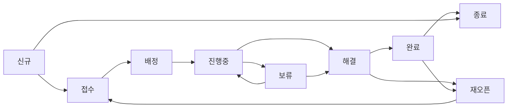

# K-ECP 통합 디자인 시스템

> KustHub(고객 허브)와 kohub(운영 허브) 간의 UI/UX 일관성을 위한 공통 디자인 시스템

## 1. 개요

### 1.1 목적

- **일관성**: 두 서비스 간 동일한 사용자 경험 제공
- **효율성**: 공통 컴포넌트 재사용으로 개발 속도 향상
- **브랜드**: K-ECP 브랜드 아이덴티티 통일

### 1.2 서비스 구분

| 서비스 | 대상 사용자 | 주요 기능 |
|--------|-------------|-----------|
| **KustHub** | 고객 (CSP/MSP 이용자) | 공지사항, 문의(티켓), 자료실, 가이드 |
| **kohub** | 운영자 (MSP 담당자) | 호스트 관리, 티켓 처리, 터미널, 모니터링 |

---

## 2. 브랜드 컬러

### 2.1 Primary Colors

```css
:root {
  /* K-ECP Primary */
  --kecp-primary: #0066CC;
  --kecp-primary-dark: #004080;
  --kecp-primary-light: #E6F0FA;
  
  /* Secondary */
  --kecp-secondary: #00A3E0;
  --kecp-accent: #00C4B4;
  
  /* Gradients */
  --kecp-gradient: linear-gradient(135deg, #0066CC 0%, #00A3E0 100%);
  --kecp-gradient-light: linear-gradient(135deg, #E6F0FA 0%, #E0F7FA 100%);
}
```

### 2.2 Neutral Colors

```css
:root {
  --kecp-gray-50: #F8FAFC;
  --kecp-gray-100: #F1F5F9;
  --kecp-gray-200: #E2E8F0;
  --kecp-gray-300: #CBD5E1;
  --kecp-gray-500: #64748B;
  --kecp-gray-600: #475569;
  --kecp-gray-700: #334155;
  --kecp-gray-900: #0F172A;
}
```

### 2.3 Semantic Colors

```css
:root {
  /* Status Colors */
  --color-success: #16A34A;
  --color-success-light: #DCFCE7;
  --color-warning: #D97706;
  --color-warning-light: #FEF3C7;
  --color-error: #DC2626;
  --color-error-light: #FEE2E2;
  --color-info: #0066CC;
  --color-info-light: #E6F0FA;
}
```

---

## 3. 타이포그래피

### 3.1 폰트 패밀리

```css
body {
  font-family: 'Pretendard', -apple-system, BlinkMacSystemFont, system-ui, sans-serif;
}
```

- **Pretendard**: 한글 가독성이 뛰어난 웹폰트
- CDN: `https://cdn.jsdelivr.net/gh/orioncactus/pretendard/dist/web/static/pretendard.css`

### 3.2 폰트 사이즈

| 용도 | 클래스 | 크기 |
|------|--------|------|
| 페이지 제목 | `text-2xl` | 1.5rem (24px) |
| 섹션 제목 | `text-lg` | 1.125rem (18px) |
| 본문 | `text-sm` | 0.875rem (14px) |
| 캡션/라벨 | `text-xs` | 0.75rem (12px) |

### 3.3 폰트 웨이트

| 용도 | 클래스 | 웨이트 |
|------|--------|--------|
| 제목 | `font-bold` | 700 |
| 강조 | `font-semibold` | 600 |
| 일반 | `font-medium` | 500 |
| 기본 | `font-normal` | 400 |

---

## 4. 공통 컴포넌트

### 4.1 Button

```tsx
// Primary Button
<button className="kecp-btn-primary">
  저장
</button>

// Secondary Button
<button className="kecp-btn-secondary">
  취소
</button>

// CSS
.kecp-btn-primary {
  background: var(--kecp-gradient);
  color: white;
  padding: 0.625rem 1.25rem;
  border-radius: 8px;
  font-weight: 500;
}

.kecp-btn-secondary {
  background: white;
  color: var(--kecp-primary);
  border: 1px solid var(--kecp-primary);
  padding: 0.625rem 1.25rem;
  border-radius: 8px;
}
```

### 4.2 Card

```tsx
<div className="kecp-card">
  {/* content */}
</div>

// CSS
.kecp-card {
  background: white;
  border-radius: 12px;
  border: 1px solid var(--kecp-gray-200);
  box-shadow: 0 1px 3px rgba(0, 0, 0, 0.05);
}

.kecp-card:hover {
  box-shadow: 0 4px 12px rgba(0, 102, 204, 0.1);
  border-color: var(--kecp-primary);
}
```

### 4.3 Status Badge

```tsx
// 상태 설정
const statusConfig = {
  NEW: { label: '신규', color: 'bg-blue-100 text-blue-700' },
  RECEIVED: { label: '접수', color: 'bg-blue-100 text-blue-700' },
  ASSIGNED: { label: '배정', color: 'bg-indigo-100 text-indigo-700' },
  IN_PROGRESS: { label: '진행중', color: 'bg-yellow-100 text-yellow-700' },
  PENDING: { label: '보류', color: 'bg-orange-100 text-orange-700' },
  RESOLVED: { label: '해결', color: 'bg-teal-100 text-teal-700' },
  COMPLETED: { label: '완료', color: 'bg-green-100 text-green-700' },
  CLOSED: { label: '종료', color: 'bg-gray-200 text-gray-600' },
  REOPENED: { label: '재오픈', color: 'bg-orange-100 text-orange-700' },
  // 호스트 상태 (kohub)
  ACTIVE: { label: '활성', color: 'bg-green-100 text-green-700' },
  INACTIVE: { label: '비활성', color: 'bg-gray-100 text-gray-600' },
  MAINTENANCE: { label: '점검중', color: 'bg-yellow-100 text-yellow-700' },
};
```

### 4.4 Priority Badge

```tsx
const priorityConfig = {
  CRITICAL: { label: 'CRITICAL', color: 'bg-red-100 text-red-700 border-red-300' },
  HIGH: { label: 'HIGH', color: 'bg-orange-100 text-orange-700 border-orange-300' },
  MEDIUM: { label: 'MEDIUM', color: 'bg-blue-100 text-blue-700 border-blue-300' },
  LOW: { label: 'LOW', color: 'bg-gray-100 text-gray-700 border-gray-300' },
  // KustHub P1~P4 호환
  P1: { label: 'P1', color: 'bg-red-100 text-red-700 border-red-300' },
  P2: { label: 'P2', color: 'bg-orange-100 text-orange-700 border-orange-300' },
  P3: { label: 'P3', color: 'bg-yellow-100 text-yellow-700 border-yellow-300' },
  P4: { label: 'P4', color: 'bg-gray-100 text-gray-700 border-gray-300' },
};
```

### 4.5 Loading Spinner

```tsx
<div className="kecp-spinner" />

// CSS
.kecp-spinner {
  width: 2rem;
  height: 2rem;
  border: 3px solid var(--kecp-gray-200);
  border-top-color: var(--kecp-primary);
  border-radius: 50%;
  animation: spin 1s linear infinite;
}

@keyframes spin {
  to { transform: rotate(360deg); }
}
```

### 4.6 Empty State

```tsx
<div className="empty-state">
  <Icon className="w-12 h-12 text-gray-300" />
  <p className="text-gray-500 mt-4">데이터가 없습니다</p>
</div>
```

---

## 5. 레이아웃

### 5.1 헤더 구조

```
┌─────────────────────────────────────────────────────────────┐
│ [Top Bar] K-ECP 메인 | 마켓플레이스     운영시간: 09:00~18:00 │
├─────────────────────────────────────────────────────────────┤
│ [Logo] K-ECP 고객센터/운영센터    [Nav] 메뉴들    [User] 👤 ▼ │
└─────────────────────────────────────────────────────────────┘
```

### 5.2 사이드바 (kohub)

kohub은 운영 도구이므로 사이드바 레이아웃 사용:

```
┌──────────────────────────────────────────────────────────┐
│ [Header]                                                 │
├──────────┬───────────────────────────────────────────────┤
│ Sidebar  │ Main Content                                  │
│ - 대시보드 │                                              │
│ - 호스트  │                                              │
│ - 티켓    │                                              │
│ - 터미널  │                                              │
│ - 설정    │                                              │
└──────────┴───────────────────────────────────────────────┘
```

### 5.3 Max Width

- 컨텐츠 영역: `max-w-7xl` (1280px)
- 폼 영역: `max-w-2xl` (672px)

### 5.4 Spacing

| 용도 | 값 |
|------|-----|
| 페이지 패딩 | `p-6` (1.5rem) |
| 섹션 간 간격 | `space-y-6` |
| 카드 내부 패딩 | `p-4` ~ `p-6` |
| 그리드 갭 | `gap-4` ~ `gap-6` |

---

## 6. 반응형 디자인

### 6.1 Breakpoints

| 이름 | 크기 | 용도 |
|------|------|------|
| `sm` | 640px | 모바일 가로 |
| `md` | 768px | 태블릿 |
| `lg` | 1024px | 데스크톱 |
| `xl` | 1280px | 대형 화면 |

### 6.2 모바일 대응

#### 반응형 테이블
```css
@media (max-width: 768px) {
  .responsive-table thead { display: none; }
  .responsive-table tr { 
    display: flex;
    flex-direction: column;
    background: white;
    border-radius: 12px;
    padding: 1rem;
  }
}
```

#### 모바일 바텀 네비게이션
```css
.mobile-bottom-nav {
  display: none;
}

@media (max-width: 768px) {
  .mobile-bottom-nav {
    display: flex;
    position: fixed;
    bottom: 0;
    left: 0;
    right: 0;
  }
}
```

---

## 7. 아이콘

### 7.1 라이브러리

- **Lucide React**: 일관된 선형 아이콘
- 설치: `npm install lucide-react`

### 7.2 아이콘 사이즈

| 용도 | 크기 |
|------|------|
| 네비게이션 | `w-5 h-5` |
| 버튼 내부 | `w-4 h-4` |
| 빈 상태 | `w-12 h-12` |

### 7.3 공통 아이콘 매핑

| 기능 | KustHub | kohub |
|------|---------|-------|
| 대시보드 | `LayoutDashboard` | `LayoutDashboard` |
| 티켓 | `HelpCircle` | `TicketCheck` |
| 호스트 | - | `Server` |
| 터미널 | - | `Terminal` |
| 공지사항 | `FileText` | - |
| 설정 | `Settings` | `Settings` |

---

## 8. 상태 표현

### 8.1 티켓 상태 (공통)



### 8.2 호스트 상태 (kohub)

| 상태 | 색상 | 의미 |
|------|------|------|
| ACTIVE | 녹색 | 정상 운영 |
| INACTIVE | 회색 | 비활성화 |
| MAINTENANCE | 노란색 | 점검 중 |

### 8.3 우선순위 (공통)

| kohub | KustHub | 의미 | 색상 |
|-------|---------|------|------|
| CRITICAL | P1 | 긴급 | 빨강 |
| HIGH | P2 | 높음 | 주황 |
| MEDIUM | P3 | 보통 | 파랑/노랑 |
| LOW | P4 | 낮음 | 회색 |

---

## 9. 인터랙션

### 9.1 Hover 효과

```css
/* 카드 호버 */
.kecp-card:hover {
  box-shadow: 0 4px 12px rgba(0, 102, 204, 0.1);
  border-color: var(--kecp-primary);
}

/* 버튼 호버 */
.kecp-btn-primary:hover {
  opacity: 0.9;
  transform: translateY(-1px);
}
```

### 9.2 Focus 상태

```css
input:focus, select:focus, textarea:focus {
  outline: none;
  ring: 2px;
  ring-color: var(--kecp-primary);
  border-color: var(--kecp-primary);
}
```

### 9.3 애니메이션

```css
/* 스피너 */
@keyframes spin {
  to { transform: rotate(360deg); }
}

/* 스켈레톤 로딩 */
@keyframes skeleton-loading {
  0% { background-position: 200% 0; }
  100% { background-position: -200% 0; }
}
```

---

## 10. 적용 가이드

### 10.1 신규 컴포넌트 개발 시

1. **색상**: CSS 변수(`--kecp-*`) 사용
2. **스타일**: Tailwind CSS 클래스 + 커스텀 클래스
3. **아이콘**: Lucide React 사용
4. **폰트**: Pretendard 적용 확인

### 10.2 기존 컴포넌트 수정 시

1. 하드코딩된 색상 → CSS 변수로 변환
2. 인라인 스타일 → Tailwind 클래스로 변환
3. 반응형 확인 (모바일/태블릿/데스크톱)

### 10.3 체크리스트

- [ ] CSS 변수 사용 여부
- [ ] 반응형 디자인 적용
- [ ] 접근성 (키보드 네비게이션, ARIA)
- [ ] 로딩/에러 상태 처리
- [ ] 빈 상태 UI
- [ ] 다크 모드 지원 (향후)

---

## 11. 참고 자료

- [Tailwind CSS 문서](https://tailwindcss.com/docs)
- [Lucide 아이콘](https://lucide.dev/icons/)
- [Pretendard 폰트](https://cactus.tistory.com/306)

---

## Changelog

| 날짜 | 버전 | 변경 내용 |
|------|------|----------|
| 2026-02-04 | 1.0.0 | 초기 디자인 시스템 문서 작성 |
